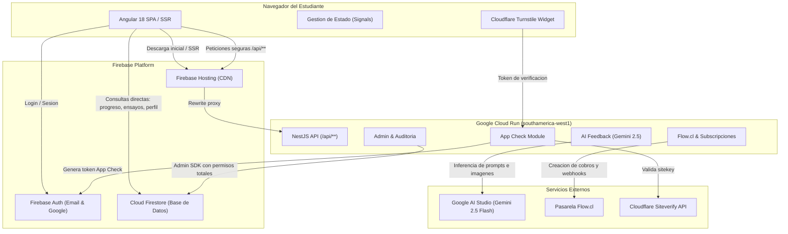

# EstudiaUni.cl - Plataforma de Preparacion PAES

[](https://angular.dev/)
[](https://nestjs.com/)
[](https://www.typescriptlang.org/)
[](https://firebase.google.com/)
[](https://cloud.google.com/run)
[](https://aistudio.google.com/)
[](#licencia)

Plataforma web integral de alto rendimiento orientada a la preparacion de la Prueba de Acceso a la Educacion Superior (PAES) en Chile. Integra rutas de aprendizaje gamificadas, ensayos oficiales DEMRE cronometrados y asistidos, un tutor inteligente impulsado por Google Gemini 2.5 Flash, buscador vocacional con datos oficiales de admision, calculadora NEM/Ranking y un sistema freemium con pasarela de pagos.

---

## Tabla de Contenidos

- [1. Descripcion General](#1-descripcion-general)
- [2. Caracteristicas Principales](#2-caracteristicas-principales)
- [3. Arquitectura del Sistema](#3-arquitectura-del-sistema)
  - [3.1. Diagrama de Flujo y Componentes](#31-diagrama-de-flujo-y-componentes)
  - [3.2. Patron de Comunicacion Hibrido](#32-patron-de-comunicacion-hibrido)
- [4. Pila Tecnologica](#4-pila-tecnologica)
- [5. Estructura del Repositorio](#5-estructura-del-repositorio)
- [6. Modulos y Funcionalidades en Detalle](#6-modulos-y-funcionalidades-en-detalle)
  - [6.1. Ruta de Aprendizaje](#61-ruta-de-aprendizaje)
  - [6.2. Ensayos PAES Oficiales y Mini Ensayos](#62-ensayos-paes-oficiales-y-mini-ensayos)
  - [6.3. Tutor Virtual Foco](#63-tutor-virtual-foco)
  - [6.4. Herramientas Vocacionales y Academicas](#64-herramientas-vocacionales-y-academicas)
  - [6.5. Panel de Administracion](#65-panel-de-administracion)
- [14. Convenciones de Codigo](#14-convenciones-de-codigo)
- [15. Licencia y Creditos](#15-licencia-y-creditos)

---

## 1. Descripcion General

EstudiaUni.cl es un ecosistema educativo desarrollado para optimizar el rendimiento de estudiantes chilenos que rinden la PAES. El sistema resuelve las limitaciones de los preuniversitarios tradicionales combinando:

- **Estructura Pedagogica Incremental:** Curriculo organizado por materias, capitulos, secciones y evaluaciones formativas que guian al alumno paso a paso.
- **Simulacion Realista:** Pruebas cronometradas construidas sobre los facsimiles oficiales liberados por el DEMRE, respetando ponderaciones y tiempos exactos.
- **Retroalimentacion Inteligente:** Identificacion precisa de distractores y errores conceptuales mediante inteligencia artificial generativa.
- **Accesibilidad y Rendimiento:** Aplicacion web moderna con prerenderizado estatico (SSR) para rutas clave, diseno responsivo optimizado para moviles y soporte para herramientas de accesibilidad (modo dislexia, alto contraste, navegacion por teclado).

---

## 2. Caracteristicas Principales

- **Ruta Gamificada:** 8 materias oficiales con avance por niveles, desafios de jefe de capitulo ("Boss Levels") y minijuegos pedagogicos (clasificacion, completar oraciones, emparejar terminos, ordenamiento cronologico).
- **Simulacros Oficiales:** Ensayos completos DEMRE (procesos regular e invierno) con modos "Real" (condiciones de examen estricto) y "Asistido" (con pausa y asistencia guiada).
- **Mini Ensayos a la Medida:** Generacion dinamica de cuestionarios de 10, 20 o 30 preguntas focalizadas en ejes tematicos debiles, incluyendo un "Modo Mejorador" para repetir unicamente fallos anteriores.
- **Tutor IA "Foco":** Sistema multicontexto impulsado por Google Gemini 2.5 Flash con capacidad de vision artificial para interpretar diagramas, formulas y graficos escaneados de las pruebas reales.
- **Mente Veloz:** Minijuego de agilidad y calculo mental contrarreloj para agilizar el procesamiento numerico y verbal.
- **Buscador Vocacional "Encuentra tu Carrera":** Base de datos indexada con estadisticas oficiales de postulacion, aranceles, ingresos y ponderaciones del sistema de admision chileno.
- **Calculadora NEM y Ranking:** Computo homologado con las tablas de conversion oficiales del DEMRE para colegios Cientifico-Humanistas y Tecnico-Profesionales.
- **Panel Administrativo:** Suite interna para gestion de contenido, pool de preguntas, metricas de usuarios, aprobacion de transferencias bancarias y auditoria.

---

## 3. Arquitectura del Sistema

El proyecto opera como un monorepo modular disenado para separar responsabilidades de entrega estatica, consulta directa de datos y procesamiento seguro en backend.

### 3.1. Diagrama de Flujo y Componentes



### 3.2. Patron de Comunicacion Hibrido

1. **Lectura y Escritura Directa en Firestore:**
   - La aplicacion Angular se conecta directamente a Cloud Firestore para perfiles de usuario, avance en materias, registro de actividades, lectura de ensayos y almacenamiento de intentos de examen.
   - La seguridad no reside en una capa intermediaria de software, sino en reglas declarativas en `firestore.rules` validadas por los propios servidores de Google.

2. **Servicios de Backend Especializados (NestJS en Cloud Run):**
   - El backend solo interviene en operaciones sensibles que demandan secretos de servidor o procesamiento de alto costo:
     - Orquestacion de prompts e inferencia en Google Gemini (`/api/ai/*`).
     - Creacion y confirmacion criptografica de pagos con Flow.cl (`/api/subscriptions/*`).
     - Emision de tokens de Firebase App Check con Cloudflare Turnstile (`/api/app-check/*`).
     - Control administrativo de usuarios, aprobacion de pagos y auditoria (`/api/admin/*`).

---

## 4. Pila Tecnologica

| Capa | Tecnologia | Version | Proposito |
|---|---|---|---|
| **Frontend** | Angular | 18.2.0 | Framework SPA reactivo basado en Standalone Components y Signals |
| **Frontend SSR** | @angular/ssr | 18.2.21 | Prerenderizado estatico para SEO en rutas publicas institucionales |
| **SDK Firebase** | @angular/fire / firebase | 18.0.1 / 10.14.1 | Autenticacion y conexion reactiva en tiempo real a Firestore |
| **Renderizado Matematico** | KaTeX | 0.16.45 | Renderizado nativo de formulas matematicas complejas (M1 y M2) |
| **Renderizado Markdown** | Marked | 17.0.5 | Formateo dinamico de respuestas pedagodicas del tutor IA |
| **Onboarding** | Driver.js | 1.4.0 | Tours guiados interactivos para nuevos estudiantes |
| **Backend** | NestJS | 10.4.0 | Framework modular en TypeScript para APIs REST estructuradas |
| **Inteligencia Artificial** | @google/generative-ai | 0.24.1 | Integracion con el modelo Google Gemini 2.5 Flash |
| **SDK Administrativo** | firebase-admin | 12.0.0 | Gestion de usuarios, App Check y Firestore con privilegios de sistema |
| **Rate Limiting** | @nestjs/throttler | 6.0.0 | Proteccion contra saturacion (60 peticiones/minuto global) |
| **Proteccion Anti-Bots** | Cloudflare Turnstile | v0 | Desafios invisibles sin friccion para verificacion de clientes |
| **Pasarela de Pagos** | Flow.cl | REST API | Procesamiento de pagos en Chile (Webpay, debito, credito) |
| **Hosting & Base de Datos** | Firebase / GCP | - | Firebase Hosting, Cloud Firestore y Google Cloud Run |

---

## 5. Estructura del Repositorio

```
estudiauni.cl/
|-- frontend-app/                     Aplicacion cliente en Angular 18
|   |-- src/
|   |   |-- app/
|   |   |   |-- core/                Servicios transversales, guards e interceptores
|   |   |   |   |-- guards/          authGuard, adminGuard, emailVerifiedGuard
|   |   |   |   `-- services/        firestore, auth, ai-assist, dashboard, seo, toast
|   |   |   |-- features/            Modulos funcionales de la plataforma
|   |   |   |   |-- admin/           Panel administrativo unificado y submodulos
|   |   |   |   |-- auth/            Home/Landing, login, registro, verificacion de email
|   |   |   |   |-- career-finder/   Buscador vocacional y chat con Foco
|   |   |   |   |-- dashboard/       Panel del estudiante, metas PAES y rachas
|   |   |   |   |-- dev/             Harness de pruebas aislado (/dev/ruta)
|   |   |   |   |-- learning-path/   Ruta de aprendizaje, nodos, practicas y KaTeX
|   |   |   |   |-- mente-veloz/     Juego de velocidad numerica contrarreloj
|   |   |   |   |-- mini-ensayos/    Generador y runner de mini evaluaciones
|   |   |   |   |-- nem-calculator/  Calculadora oficial de NEM y puntaje ranking
|   |   |   |   |-- payment/         Modal de checkout y confirmacion de Flow
|   |   |   |   |-- recursos/        Biblioteca de guias, libros y material de estudio
|   |   |   |   `-- simulations/     Ensayos PAES oficiales (runner y revision)
|   |   |   `-- shared/              Componentes visuales y layouts compartidos
|   |   |-- assets/                  Bases de datos JSON de facsimiles y recursos multimedia
|   |   |-- environments/            Variables de configuracion (produccion y desarrollo)
|   |   `-- prerender-routes.txt     Rutas estaticas prerenderizadas para Googlebot
|   `-- angular.json                 Configuracion del build y optimizacion de empaquetado
|
|-- backend/                          API REST en NestJS 10
|   |-- src/
|   |   |-- admin/                   Endpoints protegidos para administradores
|   |   |-- ai-feedback/             Orquestacion de Google Gemini, prompts y vision
|   |   |-- app-check/               Validador de Turnstile y emisor de tokens App Check
|   |   |-- common/                  Guards globales (Throttler, FirebaseAuthGuard)
|   |   |-- firebase/                Inicializador del SDK de Firebase Admin
|   |   |-- subscriptions/           Integracion con Flow.cl, pases PRO y transferencias
|   |   `-- users/                   Servicio de usuarios y perfiles
|   `-- .env.example                 Plantilla de variables de entorno de servidor
|
|-- content/                          Fuente de verdad versionada de contenidos
|   `-- pool-preguntas/              Bancos JSON estructurados por materia y eje tematico
|
|-- tools/                            Herramientas de soporte y mantenimiento
|   |-- pool-preguntas/              Scripts de validacion, balance y subida a Firestore
|   `-- meta/                        Compilador de resumenes de conteo (build-meta.js)
|
|-- firestore.rules                   Politicas de seguridad y permisos de Cloud Firestore
|-- firestore.indexes.json            Indices compuestos para consultas ordenadas
|-- firebase.json                     Reglas de Hosting, caching y enrutamiento hacia Cloud Run
|-- actualizar.bat                    Script de despliegue del frontend a Firebase Hosting
`-- desplegar-backend.bat             Script de despliegue del backend a Google Cloud Run
```

---

## 6. Modulos y Funcionalidades en Detalle

### 6.1. Ruta de Aprendizaje
Organizada bajo el curriculo vigente del DEMRE en cuatro niveles: **Materia -> Capitulo -> Seccion -> Test**.

- **8 Materias Disponibles:** Competencia Lectora, M1, M2, Biologia, Fisica, Quimica, Ciencias TP e Historia.
- **Tipos de Nodos:**
  - *Guias en Diapositivas:* Sintesis teorica paso a paso para lectura rapida.
  - *Minijuegos Didacticos:* Clasificacion semantica, seleccion de sinonimos, completar oraciones, emparejamiento conceptual y preguntas rapidas.
  - *Fórmulas con KaTeX:* Representacion grafica fiel de expresiones algebraicas y modelos fisicos.
  - *Jefes de Capitulo:* Evaluaciones acumulativas que habilitan el desbloqueo del siguiente capitulo.

### 6.2. Ensayos PAES Oficiales y Mini Ensayos
- **Simulacros Oficiales:** Pruebas reales digitalizadas con dos modalidades:
  - *Modo Real:* Temporizador inexorable con condiciones oficiales, sin pausas ni ayudas externas. Al concluir, los resultados pasan por un periodo de retencion para usuarios del plan gratuito y se aplica un periodo de descanso (cooldown) de 48 horas.
  - *Modo Asistido:* Flexibilidad horaria, posibilidad de guardar el avance y boton de consulta asistida a Foco.
- **Mini Ensayos:** Cuestionarios tematicos de extension reducida (10 a 30 preguntas) para sesiones rapidas de estudio.
- **Modo Mejorador:** Algoritmo que filtra los errores cometidos en ensayos previos para transformarlos en una sesion de refuerzo correctivo.

### 6.3. Tutor Virtual Foco
Foco es la mascota y tutor de la plataforma, dotado de una personalidad empatica inspirada en el contexto estudiantil chileno. Emplea el modelo `gemini-2.5-flash` con prompts estrictamente aislados:

- **Prompt Asistente en Examen:** Solo aporta preguntas de andamiaje, pistas metodologicas y recordatorios teoricos. Tiene terminantemente vetado revelar la alternativa correcta o descartar opciones explicitamente.
- **Prompt de Revision Post-Entrega:** Analiza la prueba ya calificada. Informa la clave correcta, detalla la resolucion paso a paso y desglosa minuciosamente el error de razonamiento que justificaba la alternativa fallada por el estudiante.
- **Soporte de Vision:** Al procesar preguntas digitalizadas de ensayos DEMRE, el sistema adjunta directamente la captura grafica original para que el modelo interprete figuras, tablas y expresiones matematicas sin deformaciones de OCR.

### 6.4. Herramientas Vocacionales y Academicas
- **Mente Veloz:** Dinamica de alta intensidad con temporizador regressivo de 60 o 180 segundos. Registra marcas historicas de desempeno en almacenamiento local.
- **Encuentra tu Carrera:** Buscador universitario conectado a los registros oficiales de matricula y ponderaciones de universidades chilenas, asistido por un consultor vocacional de orientacion.
- **Calculadora NEM y Ranking:** Computa el promedio de ensenanza media (1° a 4° medio) truncado a dos decimales y calcula el puntaje oficial correspondiente a la tabla DEMRE del tipo de colegio del estudiante.
- **Recursos Adicionales:** Repositorio digital ordenado por formato (guias PDF, clases en video, lecturas y resumenes sinteticos).

### 6.5. Panel de Administracion
Modulo de acceso restringido para directores y editores de la plataforma:
- Inspeccion, edicion y creacion de reactivos del pool de preguntas.
- Visualizacion del padron de usuarios registrados con buscador en tiempo real.
- Asignacion manual, extension temporal o anulacion de membresias PRO.
- Bandeja de aprobacion de transferencias bancarias con previsualizacion de comprobantes.
- Publicador de avisos y novedades del carrusel del home (`news`).
- Registro y clasificacion de reportes de bugs informados por los alumnos.

---

## 14. Convenciones de Codigo

- **Dominio en Espanol:** La nomenclatura de negocio y variables de modelo educativo respetan el espanol chileno (`Materia`, `Capitulo`, `Seccion`, `Pregunta`, `Intento`, `enunciado`, `alternativas`). Los comentarios tecnicos y patrones arquitectonicos pueden redactarse en ingles o espanol.
- **Aislamiento de Estilos CSS:** Para evitar que reglas globales de `styles.css` colisionen con componentes de administracion u otras vistas, los selectores de modulos especificos deben utilizar prefijos claros (por ejemplo, `.admin-sidebar`, `.admin-main-content`).
- **Restriccion Visual:** Se prohibe el empleo de emojis nativos en elementos de interfaz de usuario. Las iconografias deben provenir exclusivamente de recursos vectoriales SVG inline o archivos AVIF optimizados en `assets/images/`.

---

## 15. Licencia y Creditos

Propiedad exclusiva de EstudiaUni.cl y MaltSolutions. Todos los derechos reservados.

El contenido curricular, facsimiles y reactivos oficiales son adaptaciones didacticas basadas en las publicaciones publicas de caracter informativo emitidas por el DEMRE y el Ministerio de Educacion de Chile.
